# AI Product Scene Platform

We are building an AI-driven platform for working with 3D and product scenes through voice or text commands.

## Architecture

**Architecture name:** Modular AI-Orchestrated Pipeline Architecture

## Core Flow

```text
End User
-> Client Side
-> Client Request
-> Platform Core
-> Scene Context
-> AI Services
-> Action Plan
-> Scene Modules
-> Scene Result
-> Output / Result
-> Client Response
-> Client Side
```

## Architecture Diagram Notes

The current architecture diagram represents the platform as a modular pipeline with a feedback loop back to the client.

### Primary Flow

```text
End User
-> Client Side
-> Client Request
-> Platform Core
-> Scene Context
-> AI Services
-> Action Plan
-> Scene Modules
-> Scene Result
-> Output / Result
-> Client Response
-> Client Side
```

### Diagram Components

#### End User

The user starts the process by sending an input command. The command can be text-based or voice-based.

#### Client Side

The client side is responsible for user interaction and scene visualization.

- Voice / Text Command
- 3D Preview
- Result Viewer
- Scene Controls

#### Client Request

The client request packages the user's command and the relevant client-side state before sending it to the platform core.

#### Platform Core

The platform core coordinates the request. It prepares the scene context, calls AI services, receives the action plan, and coordinates execution.

#### Scene Context

The scene context describes the current scene state and the information needed by AI services to reason about the user's command.

#### AI Services

AI services understand the user's intent and generate an action plan.

- Intent Detection
- Scene Understanding
- Action Plan

#### Action Plan

The action plan is the structured instruction set produced by AI services. It is passed to scene modules for execution.

#### Scene Modules

Scene modules execute the action plan against the scene and validate the result.

- Scene Graph
- Transform Engine
- Product Rules
- Validation

#### Scene Result

The scene result contains the outcome of the executed action plan.

#### Output / Result

The output/result layer prepares the final user-facing result.

- Updated Scene
- Scene Diff
- Explanation
- Preview Update

#### Client Response

The client response sends the result back to the client side so the user can see the updated scene, explanation, and preview changes.

### Data / Storage

Data and storage support the platform core, AI services, and scene modules.

- S3 Object Storage
- Scene Metadata DB
- Scene JSON / GLTF
- Sessions DB
- Product Catalog
- Action History

### Key Architectural Rule

AI services should not directly mutate the scene. They generate an action plan. Scene modules execute the action plan, validate the result, and produce the scene result.

## Main Modules

### Client Side

- Voice / Text Command
- 3D Preview
- Result Viewer
- Scene Controls

### Platform Core

- API Layer
- Platform Orchestrator
- Scene Context Builder
- Storage Service
- Output Builder
- Validation / Error Handler

### AI Services

- Prompt Builder
- Intent Detector
- Scene Understanding Processor
- Action Plan Generator
- Action Plan Validator
- AI Response Parser
- AI Fallback / Retry Handler

### Scene Modules

- Scene Graph Manager
- Transform Engine
- Material Engine
- Mesh Analysis Engine
- Product Rules Engine
- Scene Validation Engine
- Scene Diff Generator
- GLTF / GLB Exporter

### Data / Storage

- S3 for GLB, GLTF, assets, and exports
- Database for scene metadata, sessions, product catalog, action history, and scene diffs

## Detailed Module Map

The current module map breaks the platform into four major implementation areas: backend modules, frontend/client-side modules, AI services modules, and scene modules.

### Backend Modules

1. **API Layer**
2. **Platform Orchestrator**
3. **Scene Context Builder**
4. **AI Service Adapter**
5. **Scene Module Executor**
6. **Storage Service**
7. **Output Builder**
8. **Validation / Error Handler**

### Frontend / Client-Side Modules

1. **Command Input Module**
2. **Voice Input Module**
3. **3D Preview Module**
4. **Scene Controls Module**
5. **Result Viewer Module**
6. **Upload / Download Module**
7. **Client State Manager**
8. **API Client**

### AI Services Modules

1. **Prompt Builder** - Builds prompts from the Scene Context.
2. **Intent Detector** - Detects what the user wants to do.
3. **Scene Understanding Processor** - Interprets scene objects, roles, constraints, and relationships.
4. **Action Plan Generator** - Creates a machine-readable action plan.
5. **Action Plan Validator** - Checks AI output against allowed schemas and actions.
6. **AI Response Parser** - Parses the AI JSON response.
7. **AI Fallback / Retry Handler** - Handles invalid AI responses, low confidence, and retries.

### Scene Modules

1. **Scene Graph Manager** - Manages scene nodes, hierarchy, objects, and metadata.
2. **Transform Engine** - Applies position, rotation, and scale changes.
3. **Material Engine** - Applies material and color changes.
4. **Mesh Analysis Engine** - Calculates bounding boxes, mesh count, and distances.
5. **Product Rules Engine** - Checks product and scene behavior rules.
6. **Scene Validation Engine** - Validates actions and the updated scene state.
7. **Scene Diff Generator** - Creates a before/after change list.
8. **GLTF / GLB Exporter** - Exports the updated scene file.

## Core Data Contracts

- Client Request
- Scene Context
- Action Plan
- Scene Result
- Client Response

## MVP Structure Scheme

This is the unified structure for the MVP. The diagram is organized as a staged flow so the main pipeline is easy to follow from left to right. Supporting blocks such as contracts, storage, and validation are connected as side responsibilities instead of being mixed into every arrow.

```mermaid
flowchart LR
  User[End User]

  subgraph Client["1. apps/client - React Client"]
    ClientInput[Voice / Text Command]
    ClientUpload[Upload / Load GLB or GLTF]
    ClientPreview[3D Preview]
    ClientResult[Result Viewer]
    ClientDownload[Download Updated Scene]
  end

  subgraph Request["2. Request Contract"]
    ClientRequest[Client Request]
  end

  subgraph Core["3. apps/server - Platform Core"]
    API[API Layer]
    Orchestrator[Platform Orchestrator]
    ContextBuilder[Scene Context Builder]
    AIAdapter[AI Service Adapter]
    SceneExecutor[Scene Module Executor]
    OutputBuilder[Output Builder]
  end

  subgraph Context["4. Scene Context Contract"]
    SceneContext[Scene Context]
  end

  subgraph AI["5. AI Services MVP"]
    Intent[Intent Detector]
    Understanding[Scene Understanding Processor]
    PlanGenerator[Action Plan Generator]
    PlanValidator[Action Plan Validator]
  end

  subgraph Plan["6. Action Plan Contract"]
    ActionPlan[Action Plan]
  end

  subgraph Scene["7. Scene Modules MVP"]
    SceneGraph[Scene Graph Manager]
    Transform[Transform Engine]
    Material[Material Engine]
    MeshAnalysis[Mesh Analysis Engine]
    SceneValidation[Scene Validation Engine]
    Diff[Scene Diff Generator]
    Exporter[GLTF / GLB Exporter]
  end

  subgraph Result["8. Result Contracts"]
    SceneResult[Scene Result]
    ClientResponse[Client Response]
  end

  subgraph Storage["Data / Storage MVP"]
    Assets[Scene Assets / Exports]
    Metadata[Scene Metadata]
    Sessions[Sessions / Action History]
  end

  subgraph Validation["Validation / Error Handling"]
    ErrorHandler[Validation / Error Handler]
  end

  User --> ClientInput
  User --> ClientUpload

  ClientInput --> ClientRequest
  ClientUpload --> ClientRequest

  ClientRequest --> API
  API --> Orchestrator
  Orchestrator --> ContextBuilder
  ContextBuilder --> SceneContext
  SceneContext --> AIAdapter

  AIAdapter --> Intent
  Intent --> Understanding
  Understanding --> PlanGenerator
  PlanGenerator --> PlanValidator
  PlanValidator --> ActionPlan

  ActionPlan --> SceneExecutor
  SceneExecutor --> SceneGraph
  SceneGraph --> Transform
  Transform --> Material
  Material --> MeshAnalysis
  MeshAnalysis --> SceneValidation
  SceneValidation --> Diff
  Diff --> Exporter
  Exporter --> SceneResult

  SceneResult --> OutputBuilder
  OutputBuilder --> ClientResponse
  ClientResponse --> ClientPreview
  ClientResponse --> ClientResult
  ClientResponse --> ClientDownload

  ContextBuilder -. reads / writes .-> Metadata
  ContextBuilder -. session state .-> Sessions
  SceneExecutor -. reads source scene .-> Assets
  Exporter -. saves updated scene .-> Assets
  SceneExecutor -. action history .-> Sessions

  PlanValidator -. invalid plan .-> ErrorHandler
  SceneValidation -. invalid scene .-> ErrorHandler
  ErrorHandler -. error response .-> ClientResponse
```



### MVP Block Responsibilities

- **Client**: provides one user-facing flow for loading a scene, sending a command, previewing results, and downloading the updated scene.
- **Server**: coordinates requests, builds scene context, calls AI services, executes scene modules, and builds the client response.
- **AI Services**: detect intent and generate a validated action plan. They do not directly modify the scene.
- **Scene Modules**: execute the action plan, validate the updated scene, generate the diff, and export the result.
- **Storage**: keeps scene files, exports, metadata, session state, and action history.
- **Contracts**: define the data passed between client, server, AI services, and scene modules.

## MVP Use Cases

1. Move Object
2. Show Bounding Boxes
3. Measure Mesh Distance
4. Change Object Color
5. Download Updated Scene

## MVP Features

- Upload or load a GLB or GLTF scene
- View the scene in the 3D Preview
- Send a voice or text command
- Build the Scene Context
- Detect intent
- Generate an Action Plan
- Execute scene actions
- Show bounding boxes
- Measure mesh distance
- Move an object
- Change an object's color
- Save the updated scene
- Download the updated scene
- Show the scene diff and explanation

## MVP Development Roadmap

1. **Stabilize the project foundation** - keep the monorepo structure clear, confirm `apps/client`, `apps/server`, `packages/contracts`, and `docs`, and keep `npm run dev` working from the repository root.
2. **Define shared data contracts** - create the JavaScript-friendly contract shapes for Client Request, Scene Context, Action Plan, Scene Result, and Client Response before building deeper behavior.
3. **Build the client MVP shell** - implement the single-page React interface with upload/load controls, command input, 3D preview area, result viewer, and download action.
4. **Build the server API layer** - add minimal endpoints for scene upload/load, command execution, health checks, and result download.
5. **Implement scene storage for MVP** - support local development storage for source scenes, updated scenes, scene metadata, sessions, and action history, with a path that can later move to S3 and a database.
6. **Create the Scene Context Builder** - parse the loaded scene into a compact Scene Context that includes objects, hierarchy, transforms, materials, metadata, and user command context.
7. **Create the AI services pipeline** - implement prompt building, intent detection, scene understanding, action plan generation, action plan validation, JSON parsing, and fallback/retry handling.
8. **Create the Scene Modules pipeline** - implement the MVP scene actions: move object, show bounding boxes, measure mesh distance, change object color, validate scene state, generate scene diff, and export GLTF/GLB.
9. **Connect the full request-to-response loop** - wire Client Request -> Platform Core -> Scene Context -> AI Services -> Action Plan -> Scene Modules -> Scene Result -> Client Response -> Client UI.
10. **Validate the MVP user flows** - test the five MVP use cases end to end: Move Object, Show Bounding Boxes, Measure Mesh Distance, Change Object Color, and Download Updated Scene.

## Suggested Project Structure

Monorepo with:

- `apps/client`
- `apps/server`
- `packages/contracts`
- `docs`

## Important Implementation Note

AI Services do not directly change the scene.
AI Services generate an Action Plan.
Scene Modules execute the Action Plan and validate the result.

## Communication Preference

Whenever the user writes in English, correct the English first before answering.
